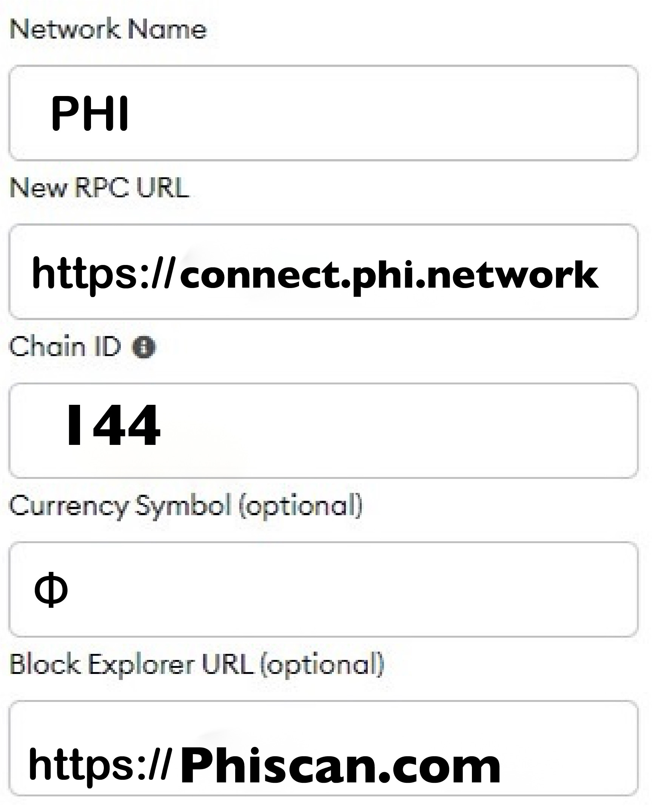

# 🏦 Additional Compatible Wallets Setup

## Connection Details 

You will need to setup your wallet in order to use PHI Smart Chain, and you can use the parameters below to configure it with your preferred wallet provider. If you are using a private ledger, you will have to contact your server administrator to request the connection parameters of the network you are trying to connect to.

Fastest Way To Automatically Set Up Both Chains Within Any Web3 Wallet Is Go To&#x20;



Go To Both The V1 Chain ID 4181 & v2 Chain ID 144

Connect Your Wallet To Each Exchange & The Chains Will Be Automatically Added To Your Wallet.&#x20;

Below You Will Find The Manual Connection Details.&#x20;


Majority Of PHI Network On Chain High Performance dApps & Enterprise Merchant Services Use The v2 Chain. v1 Chain is geared more towards private peer to peer transactions.&#x20;


## **PHI Smart Chain v2 Connection Details:**

<figure><figcaption>
v2 connection details
</figcaption></figure>

* **Network Name:** PHI
* **New RPC URL:** https://connect.phi.network
* **Chain ID:** 144
* **Symbol:** Φ
* **Block Explorer:** https://phiscan.com
* **Logo URL**: [https://dev.phi.network/phistorage/2022/05/phi.png](https://dev.phi.network/phistorage/2022/05/phi.png)


For Your Convenience Copy & Paste The Listed Above Credentials In The Add Network Form.


## PHI Smart Chain v1 Connection Details: 

* **Network Name:** PHI
* **RPC URL:** [https://rpc1.phi.network/](https://rpc1.phi.network)​
* **Chain ID: 4181**
* **Symbol: Φ**
* **Block Explorer:** [`https://explorer.phi.network`](https://explorer.phi.network)
* **Logo URL**: [https://dev.phi.network/phistorage/2022/05/phi.png](https://dev.phi.network/phistorage/2022/05/phi.png)


For Your Convenience Copy & Paste The Listed Above Credentials In The Add Network Form.


## Specific Alternative 3rd Party Wallet Guided Setup Instructions 


Mobile dApp Browser Is Great For Using dApps On Your Mobile Device As Well As Sending & Receiving. Metamask Is Great For Desktop Browser.&#x20;



Mobile dApp Browser Is Great For Using dApps On Your Mobile Device As Well As Sending & Receiving.&#x20;



Token Pocket Mobile dApp Browser Is Great For Using dApps On Your Mobile Device As Well As Sending & Receiving.&#x20;



For Sending & Receiving PHI & PHI20 Assets.&#x20;



Great To Use If You Want To Display The Value Of Tokens In Fiat Within The Wallet & For Sending & Receiving But Token Pocket Is Better For Connecting To dApps.




### Alternative RPCs 

We only recommend the usage of alternative [RPCs](https://docs.phi.network/phi-wiki/glossary#r) for advanced users, or if the main [RPC](https://docs.phi.network/phi-wiki/glossary#r) isn't working for you. Please get in touch with[ support team](https://phi.support) if you can't connect to the network. Some wallets - mostly on mobile devices - won't accept non-SSL RPCs.&#x20;

v1 chain Additional RPC Address:&#x20;

`https://rpc2.phi.network/`**🔒 SSL**

v2 chain Additional RPC Address:&#x20;

`https://connect.phi.network/`**🔒 SSL**

## Connecting to Private Ledger 

If you have deployed and is trying to connect to a private ledger, you will have to setup your own RPC, and use a regular wallet to connect to it.The settings can change on a case-to-case basis, and more documentation with specific instructions will be produced once we have launched our private ledger applications suite.

## Want to deploy a public RPC? 

If you want to deploy your own public[ RPC, ](https://docs.phi.network/phi-wiki/glossary#r)you can liaise with the [integration team](https://phi.support) so they can guide you through the process. Deploying a public [RPC ](https://docs.phi.network/phi-wiki/glossary#r)is a great public service to our community, as it effectively broadens our public connection bandwidth and ensures that users will still be able to interact with the network on an event where our public [RPCs](https://docs.phi.network/phi-wiki/glossary#r) are down or overloaded.
